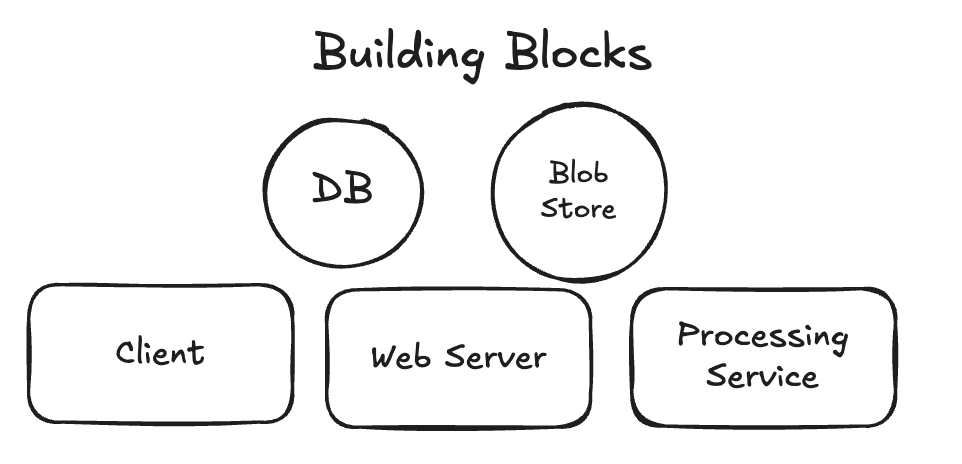
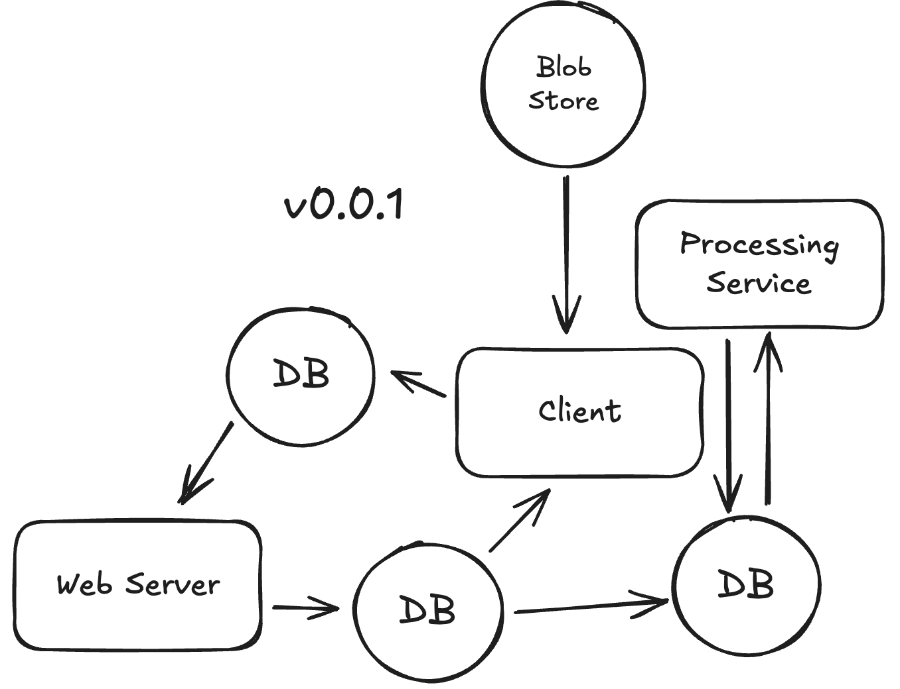
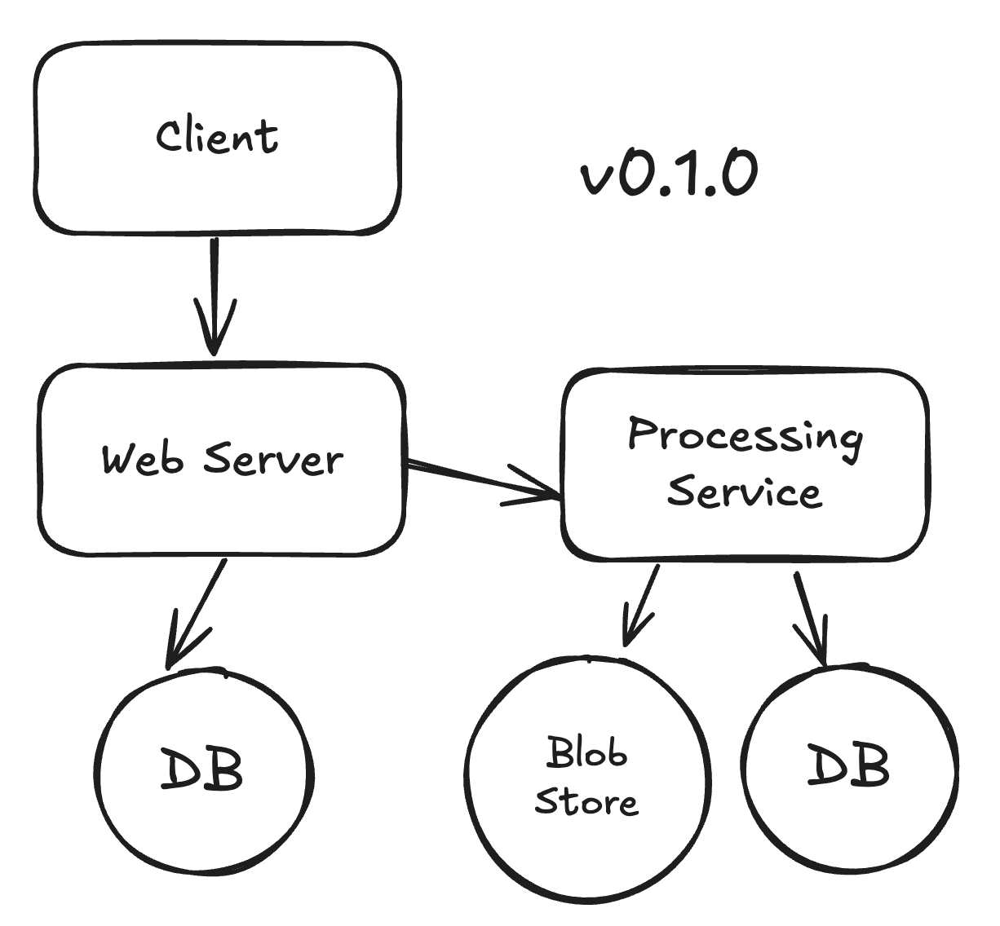
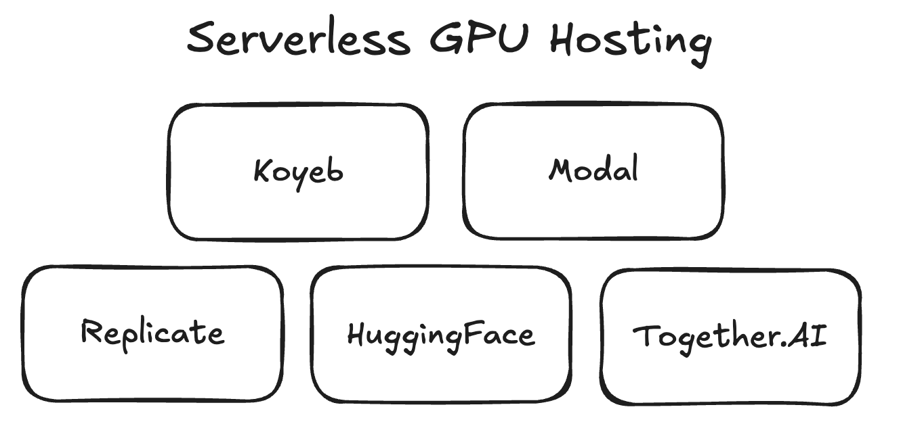
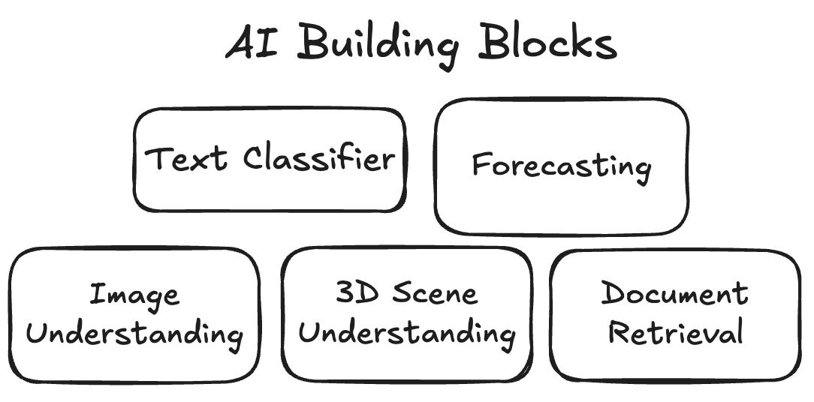
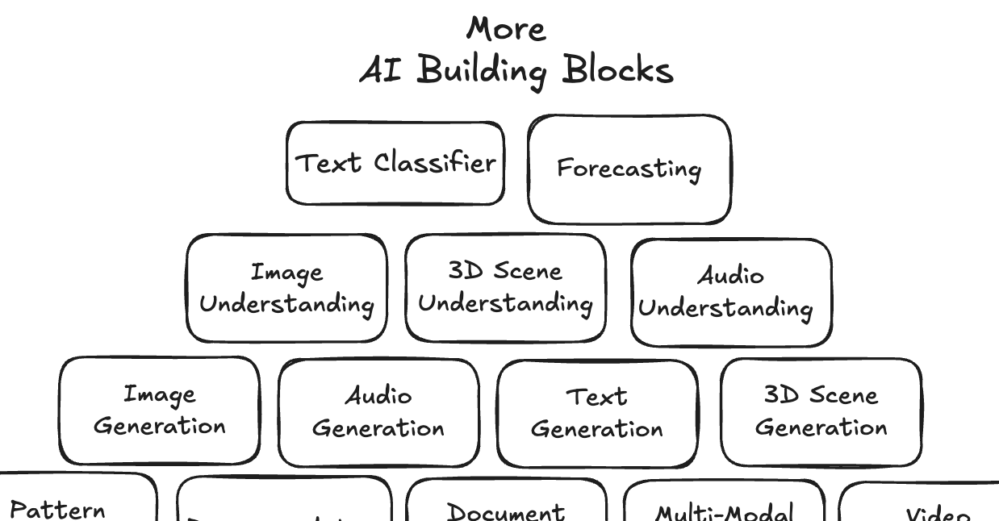

A system design might have some blocks.

You can have a go at designing a system without understanding how every building block works.

As you learn about the blocks you chose, you might revise your design.

So, you can use System Design to learn new tools.

🤓

Thanks to a boom of serverless GPU hosting options, we can deploy deep learning models as web services.

We can reason about deployed deep learning models like any other building block in a system.

But, what are the building blocks?

Welcome to the [AI Building Blocks doc site](https://ai-engineering-katas.github.io/ai-katas/capabilities/)

Use this doc site as a reference to discover

1. what AI building blocks (Capabilities) exist
1. when to use them
1. which Solution Fields enable them
1. how you can implement them with commercially-licensed Tools
