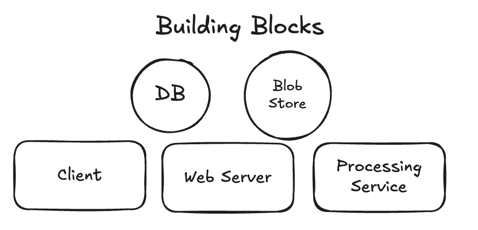
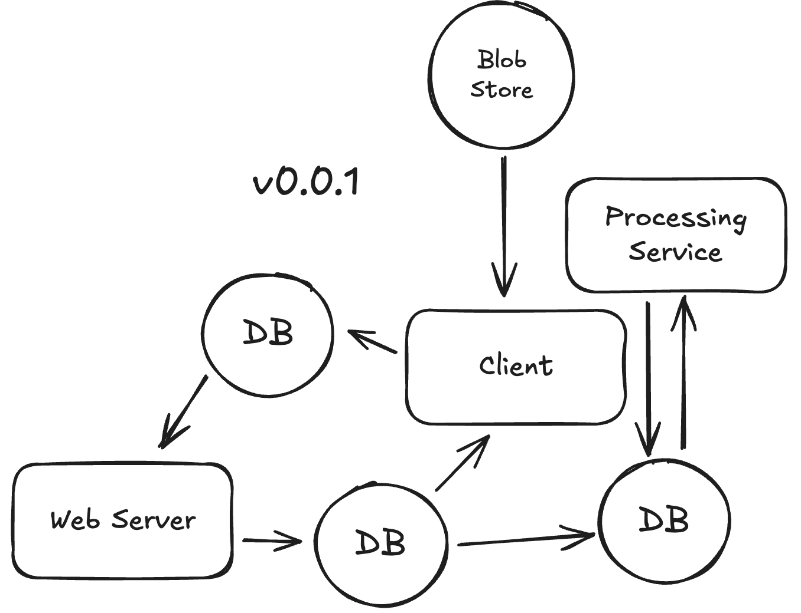
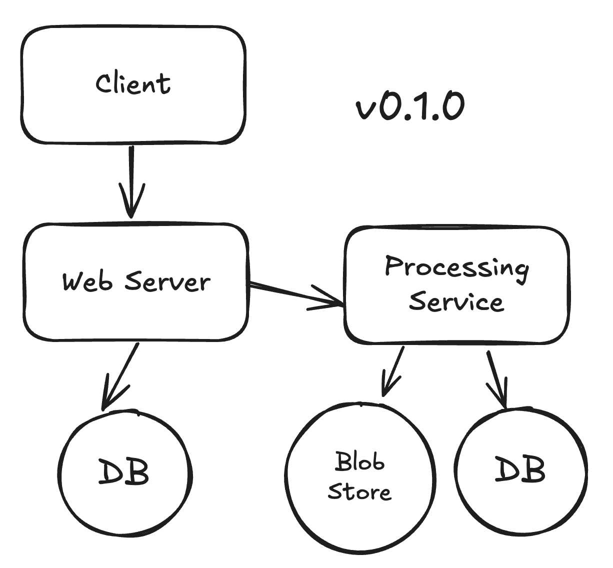
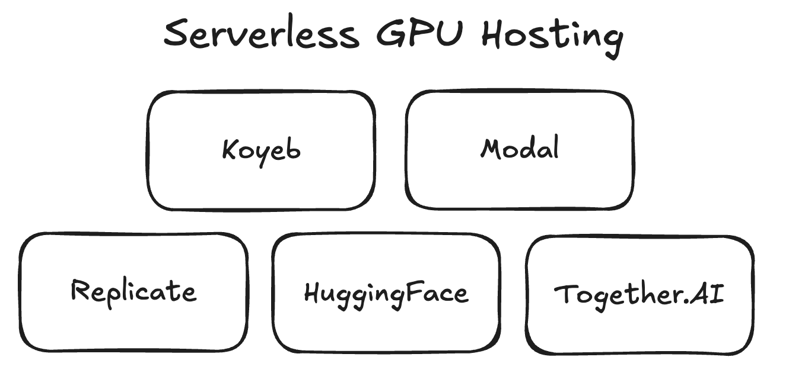
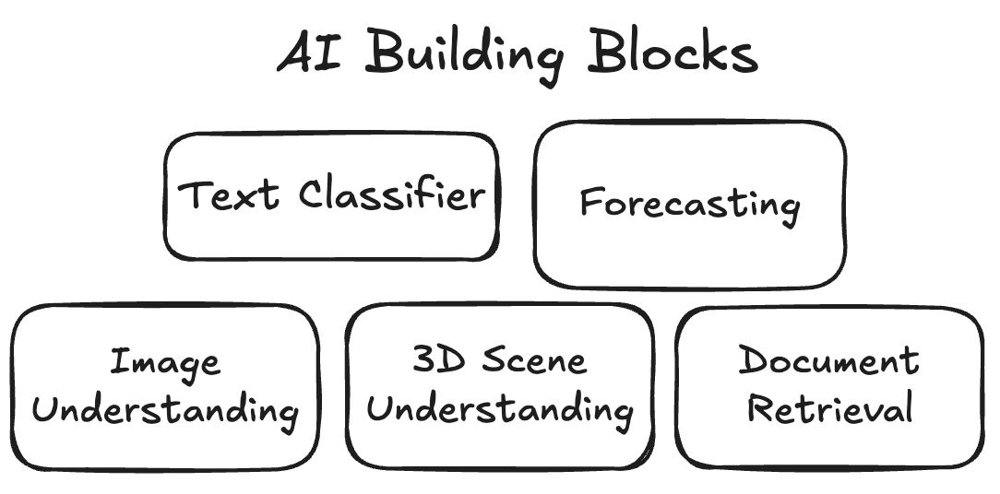

# Intro

A system design might have some blocks.

You can have a go at designing a system without understanding how every building block works.

As you learn about the blocks you chose, you might revise your design.

So, you can use System Design to learn new tools.

Thanks to a boom of serverless GPU hosting options, we can deploy deep learning models as web services.

If we treat deep learning models as services, we can reason about them as building blocks in a System Design.

So, what are all of the the building blocks? And how do I use them?

Welcome to AI Building Blocks

Use this site as a reference to discover

1. what AI Capabilities exist
1. which Solution Fields enable them
1. how you can implement them with commercially-licensed Tools

Use this site as a reference when as you practice these [katas](https://github.com/AI-Engineering-Katas/ai-katas/tree/main/katas)

