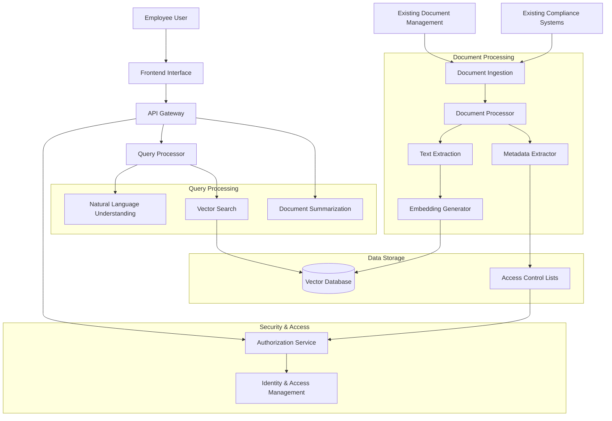
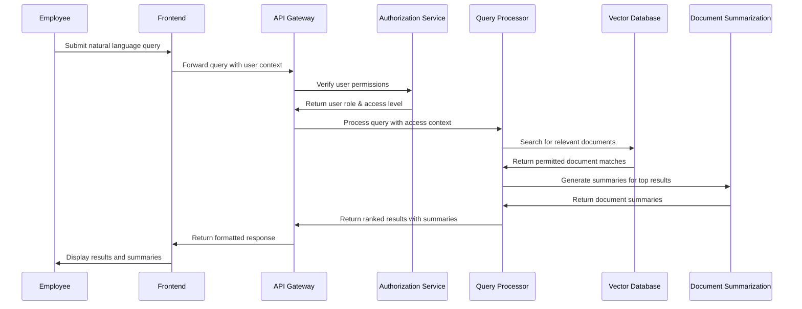
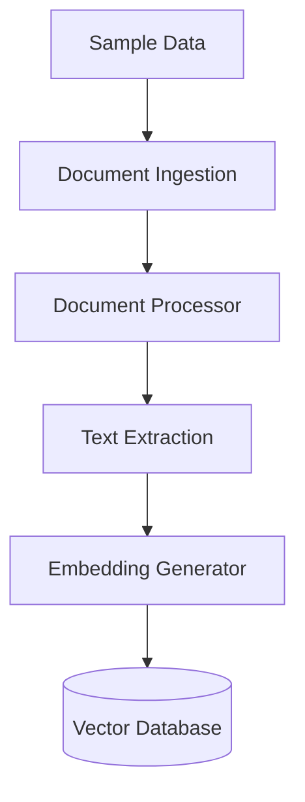
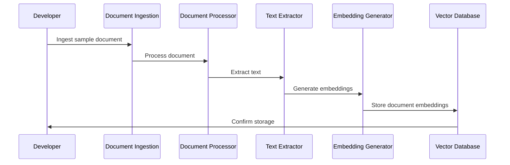
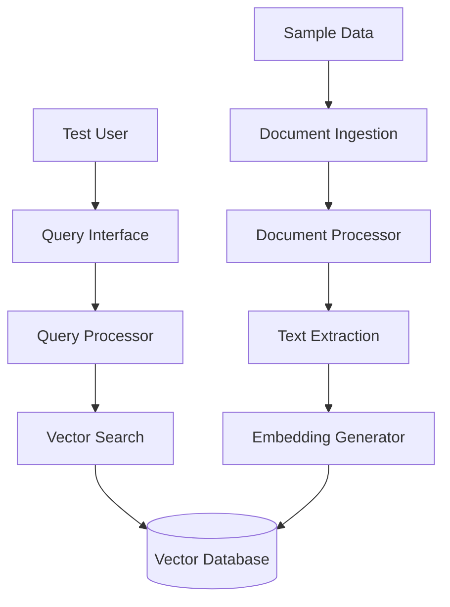
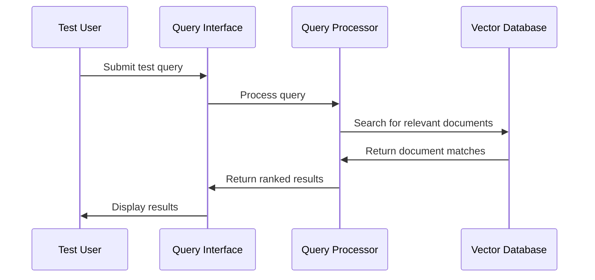
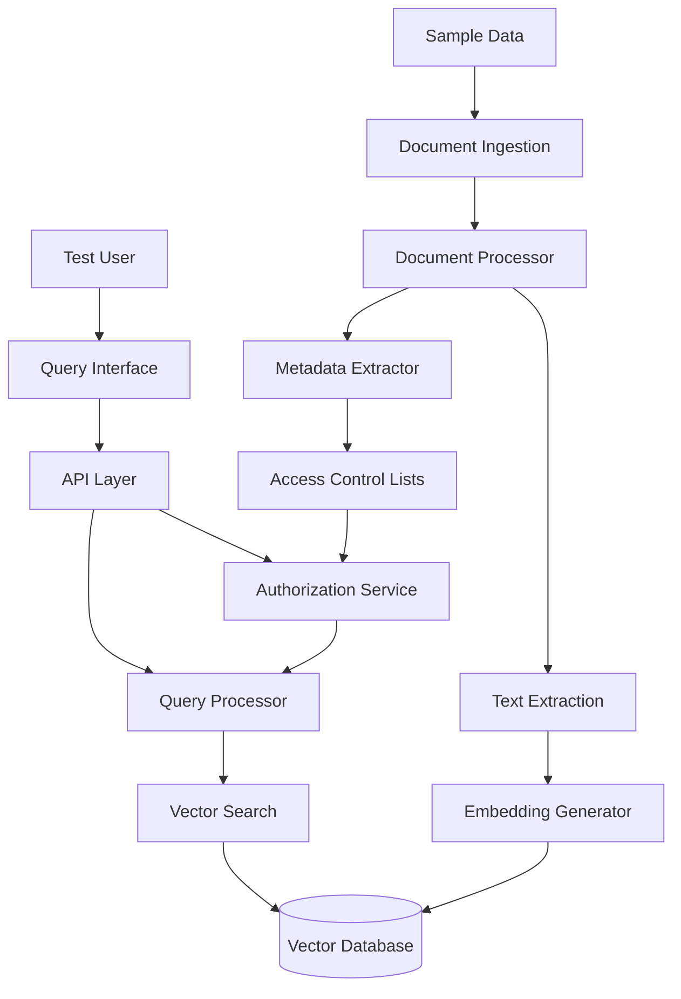
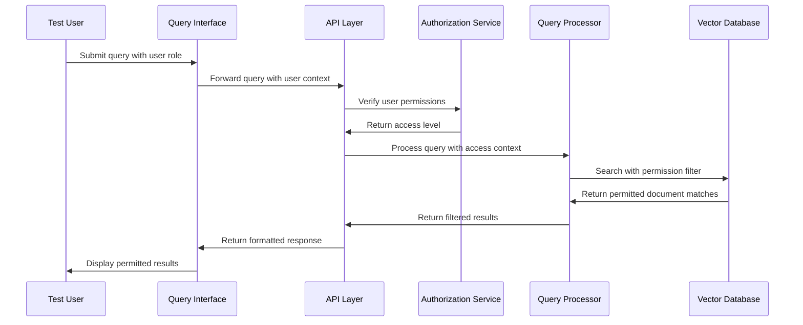
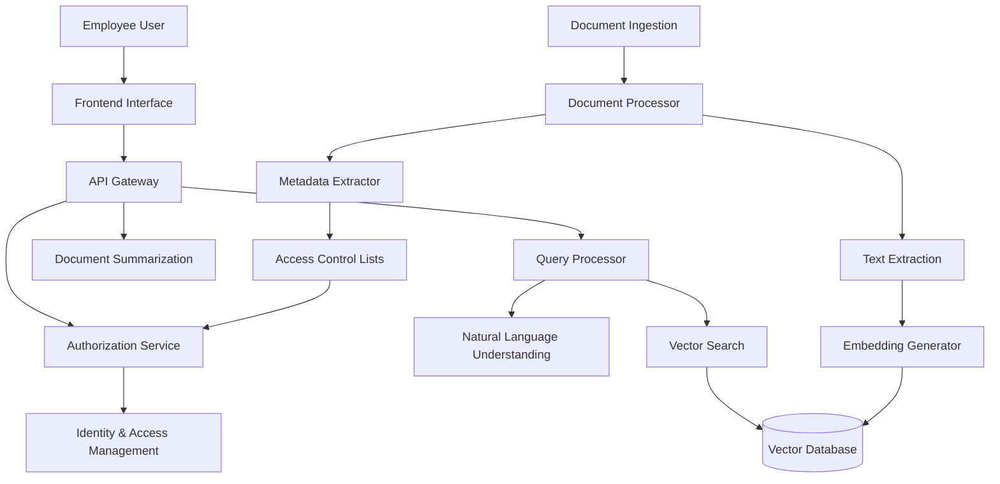

# Financial Services Knowledge Base

A GenAI-powered knowledge base solution for financial services firms that allows employees to ask questions and quickly retrieve relevant documents. The system handles complex financial queries, offers document summaries, and ensures sensitive information is accessible only to authorized users.

## Table of Contents

- [Architecture Overview](#architecture-overview)
- [Development Environment](#development-environment)
- [Tool Explanations](#tool-explanations)
- [Development Milestones](#development-milestones)
- [Getting Started](#getting-started)
- [Extension Points](#extension-points)

## Architecture Overview

### Logical Architecture



### User Request Data Flow



## Development Environment

This project uses Podman for containerization, making it compatible with macOS, Windows, and Linux. The development environment consists of the following containers:

- **API Service**: FastAPI-based backend service
- **Vector Database**: Qdrant for storing and searching document embeddings
- **Frontend**: Simple web interface for interacting with the knowledge base

### Prerequisites

- [Podman](https://podman.io/getting-started/installation)
- [Podman Compose](https://github.com/containers/podman-compose)

### Setup Instructions

#### For macOS/Linux:

```bash
# Make the setup script executable
chmod +x scripts/setup.sh

# Run the setup script
./scripts/setup.sh
```

#### For Windows:

```
# Run the setup script
scripts\setup.bat
```

## Tool Explanations

### Vector Database

The knowledge base uses [Qdrant](https://qdrant.tech/), a vector similarity search engine, to store and retrieve document embeddings.

#### How it Works

Qdrant stores document embeddings (vector representations of text) and enables efficient similarity search. When a query is processed, it's converted to an embedding and used to find the most similar documents in the database.

#### Configuration Options

- Collection creation with custom schemas
- Filtering based on document metadata
- Adjustable search parameters for precision vs. recall

#### Building Block Reference

For more information, see the [Vector Databases](https://ai-engineering-katas.github.io/ai-katas/tools/vector-databases) and [Vector Similarity Search](https://ai-engineering-katas.github.io/ai-katas/tools/vector-similarity-search) documentation.

### NLP Framework

The knowledge base uses [Hugging Face Transformers](https://huggingface.co/transformers/) for natural language processing tasks.

#### How it Works

Transformer models are used to:

- Generate embeddings for documents and queries
- Understand natural language queries
- Generate document summaries

#### Configuration Options

- Model selection for different tasks
- Fine-tuning options for domain adaptation
- Inference parameters for speed vs. accuracy tradeoffs

#### Building Block Reference

For more information, see the [NLP Frameworks](https://ai-engineering-katas.github.io/ai-katas/tools/nlp-frameworks) and [Text Analytics APIs](https://ai-engineering-katas.github.io/ai-katas/tools/text-analytics-apis) documentation.

### Document Processing Tools

The knowledge base uses various libraries for document processing, including PyPDF2 for PDF files and python-docx for Word documents.

#### How it Works

These tools extract text from different document formats, which is then processed and embedded for storage in the vector database.

#### Configuration Options

- Text extraction parameters
- Preprocessing options
- Chunking strategies for large documents

#### Building Block Reference

For more information, see the [Document Retrieval Systems](https://ai-engineering-katas.github.io/ai-katas/tools/document-retrieval-systems) documentation.

### Authorization Framework

The knowledge base implements a custom role-based access control system to ensure sensitive information is only accessible to authorized users.

#### How it Works

Document metadata includes access control information, which is used to filter search results based on the user's role and permissions.

#### Configuration Options

- Role definitions
- Permission levels
- Access control rules

#### Building Block Reference

For more information about implementing secure knowledge bases, see the [Knowledge Base Systems](https://ai-engineering-katas.github.io/ai-katas/tools/knowledge-base-systems) documentation.

### Summarization Tools

The knowledge base uses transformer models to generate concise summaries of documents.

#### How it Works

When documents are retrieved, the summarization module generates context-aware summaries that focus on the relevant parts of the document based on the user's query.

#### Configuration Options

- Summary length
- Summarization strategy (extractive vs. abstractive)
- Model parameters

#### Building Block Reference

For more information, see the [Text Understanding](https://ai-engineering-katas.github.io/ai-katas/capabilities/text-understanding) and [Text Generation](https://ai-engineering-katas.github.io/ai-katas/capabilities/text-generation) capabilities documentation.

## Development Milestones

### Milestone 1: Development Environment Setup (Completed)

The development environment is already set up with:

- Containerized services using Podman
- Basic project structure
- Sample data
- Skeleton code for all components

### Milestone 2: Document Processing Pipeline

**Goal**: Implement the document ingestion and processing system

Components to implement:

- Document ingestion from sample sources
- Text extraction and preprocessing
- Basic embedding generation





**Testing**: Verify that documents are properly processed and stored in the vector database.

**Celebration Point**: You've successfully implemented the foundation of the knowledge base - document processing and embedding generation!

### Milestone 3: Basic Query Processing

**Goal**: Implement simple query processing and vector search

Components to implement:

- Query embedding generation
- Vector similarity search
- Basic result ranking





**Testing**: Try different queries and verify that relevant documents are returned.

**Celebration Point**: Your knowledge base can now answer questions! You've implemented the core search functionality.

### Milestone 4: Authorization and Access Control

**Goal**: Implement role-based access control for documents

Components to implement:

- User role simulation
- Document-level access control
- Permission-based filtering





**Testing**: Try queries with different user roles and verify that access control is working correctly.

**Celebration Point**: Your knowledge base is now secure! Different users will see different results based on their access levels.

### Milestone 5: Document Summarization and Complete System

**Goal**: Implement document summarization and integrate all components

Components to implement:

- Document summarization
- Enhanced response formatting
- Complete system integration




**Testing**: Verify that the complete system works end-to-end with all features.

**Celebration Point**: Congratulations! You've built a complete AI-powered knowledge base for financial services with document summarization, natural language queries, and role-based access control.

## Getting Started

1. Clone this repository
2. Run the setup script for your platform (see [Setup Instructions](#setup-instructions))
3. Open the frontend in your browser: http://localhost:3000
4. Start implementing Milestone 2 by modifying the document processing code

## Extension Points

Once you've completed all milestones, consider these extensions:

1. **Advanced NLP Features**:

   - Question answering with generative AI
   - Entity extraction from documents
   - Sentiment analysis for customer feedback

2. **Integration Capabilities**:

   - Connect to real document management systems
   - Implement authentication with enterprise systems
   - Add webhooks for document updates

3. **Performance Optimization**:

   - Implement caching for frequent queries
   - Optimize embedding generation
   - Add batch processing for large document sets

4. **Enhanced User Experience**:
   - Add visualization of document relationships
   - Implement feedback mechanisms
   - Create personalized user dashboards
