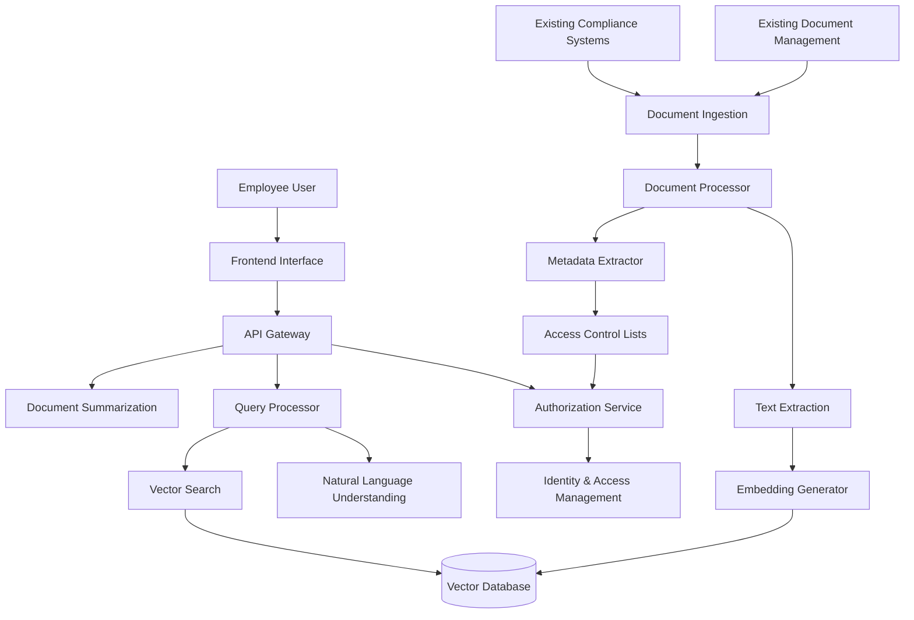
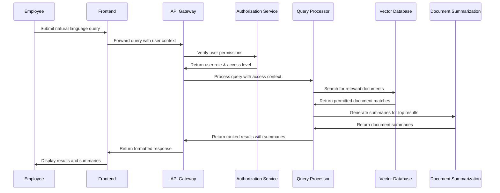
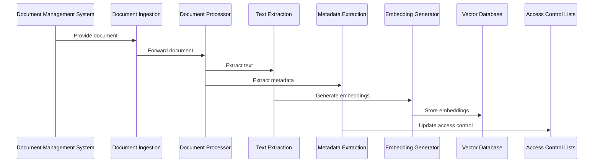

# Financial Services Knowledge Base - Architecture

This document provides a detailed overview of the architecture and components of the Financial Services Knowledge Base system.

## System Overview

The Financial Services Knowledge Base is an AI-powered system that allows employees to ask questions and quickly retrieve relevant documents. The system handles complex financial queries, offers document summaries, and ensures sensitive information is accessible only to authorized users.

## Architecture Diagram

## Core Components

### 1. Document Processing Pipeline

The document processing pipeline is responsible for ingesting documents, extracting text, generating embeddings, and storing them in the vector database.

#### Key Components:

- **Document Ingestion**: Reads documents from various sources
- **Text Extraction**: Extracts text from different file formats (TXT, PDF, DOCX)
- **Embedding Generator**: Converts text into vector embeddings using transformer models
- **Metadata Extractor**: Identifies document metadata including access control information

#### Technologies:

- **PyPDF2**: For extracting text from PDF files
- **python-docx**: For extracting text from DOCX files
- **sentence-transformers**: For generating embeddings

#### Building Block Reference:

This component implements the [Document Retrieval Systems](https://ai-engineering-katas.github.io/ai-katas/tools/document-retrieval-systems) building block.

### 2. Vector Database

The vector database stores document embeddings and enables efficient similarity search.

#### Key Components:

- **Vector Storage**: Stores document embeddings
- **Similarity Search**: Finds documents similar to a query embedding
- **Metadata Filtering**: Filters search results based on metadata

#### Technologies:

- **Qdrant**: Vector similarity search engine

#### Building Block Reference:

This component implements the [Vector Databases](https://ai-engineering-katas.github.io/ai-katas/tools/vector-databases) and [Vector Similarity Search](https://ai-engineering-katas.github.io/ai-katas/tools/vector-similarity-search) building blocks.

### 3. Query Processing

The query processing system handles natural language queries, converts them to embeddings, and searches for relevant documents.

#### Key Components:

- **Natural Language Understanding**: Processes and understands user queries
- **Query Embedding Generation**: Converts queries to vector embeddings
- **Vector Search**: Searches the vector database for similar documents
- **Result Ranking**: Ranks search results by relevance

#### Technologies:

- **sentence-transformers**: For generating query embeddings
- **Qdrant Client**: For searching the vector database

#### Building Block Reference:

This component implements the [NLP Frameworks](https://ai-engineering-katas.github.io/ai-katas/tools/nlp-frameworks) and [Neural Search](https://ai-engineering-katas.github.io/ai-katas/solutions/neural-search) building blocks.

### 4. Authorization and Access Control

The authorization system ensures that sensitive information is only accessible to authorized users.

#### Key Components:

- **User Authentication**: Simulates user authentication
- **Role-Based Access Control**: Controls access based on user roles
- **Document-Level Permissions**: Enforces access control at the document level

#### Technologies:

- **Custom RBAC Implementation**: Role-based access control system

#### Building Block Reference:

This component implements security best practices for [Knowledge Base Systems](https://ai-engineering-katas.github.io/ai-katas/tools/knowledge-base-systems).

### 5. Document Summarization

The summarization system generates concise summaries of documents to help users quickly understand their content.

#### Key Components:

- **Text Summarization**: Generates summaries of document content
- **Contextual Summarization**: Focuses summaries on the query context

#### Technologies:

- **Hugging Face Transformers**: For text summarization

#### Building Block Reference:

This component implements the [Text Understanding](https://ai-engineering-katas.github.io/ai-katas/capabilities/text-understanding) and [Text Generation](https://ai-engineering-katas.github.io/ai-katas/capabilities/text-generation) capabilities.

### 6. API Gateway

The API gateway provides a unified interface for the frontend to interact with the backend services.

#### Key Components:

- **REST API**: Provides endpoints for querying the knowledge base
- **Request Handling**: Processes incoming requests
- **Response Formatting**: Formats responses for the frontend

#### Technologies:

- **FastAPI**: For building the REST API

### 7. Frontend Interface

The frontend provides a user interface for interacting with the knowledge base.

#### Key Components:

- **Query Interface**: Allows users to enter natural language queries
- **Result Display**: Shows search results with summaries
- **User Role Selection**: Simulates different user roles

#### Technologies:

- **HTML/CSS/JavaScript**: For building the user interface
- **Bootstrap**: For styling

## Data Flow

### Query Flow

### Document Processing Flow

## Security Considerations

### Access Control

The system implements role-based access control to ensure that sensitive information is only accessible to authorized users:

- **Public Documents**: Accessible to all users
- **Department-Specific Documents**: Accessible only to users in the relevant department
- **Restricted Documents**: Accessible only to users with specific roles (e.g., managers, executives)

### Data Privacy

The system is designed to comply with data privacy regulations:

- **Document Metadata**: Includes access control information
- **User Roles**: Determine access permissions
- **Query Filtering**: Filters search results based on user permissions

## Performance Considerations

### Scalability

The system is designed to scale with increasing document volumes and user loads:

- **Vector Database**: Scales horizontally for large document collections
- **Containerized Services**: Can be scaled independently based on load
- **Stateless API**: Allows for multiple instances

### Optimization

Several optimization techniques are used to improve performance:

- **Embedding Caching**: Avoids regenerating embeddings for unchanged documents
- **Query Optimization**: Optimizes vector search parameters for speed vs. accuracy
- **Batch Processing**: Processes documents in batches for efficiency

## Extension Points

The system is designed to be extensible in several ways:

### Advanced NLP Features

- **Question Answering**: Generate direct answers to questions
- **Entity Extraction**: Identify entities in documents
- **Sentiment Analysis**: Analyze sentiment in documents

### Integration Capabilities

- **Document Management Systems**: Connect to real document management systems
- **Authentication Systems**: Integrate with enterprise authentication
- **Compliance Systems**: Connect to compliance monitoring systems

### Performance Enhancements

- **Caching**: Implement caching for frequent queries
- **Distributed Processing**: Scale document processing across multiple nodes
- **Batch Processing**: Optimize batch sizes for document processing

## Conclusion

The Financial Services Knowledge Base architecture provides a flexible and secure foundation for building an AI-powered knowledge base. By implementing the components described in this document, you will create a system that allows employees to quickly find relevant information while ensuring sensitive data is protected.
