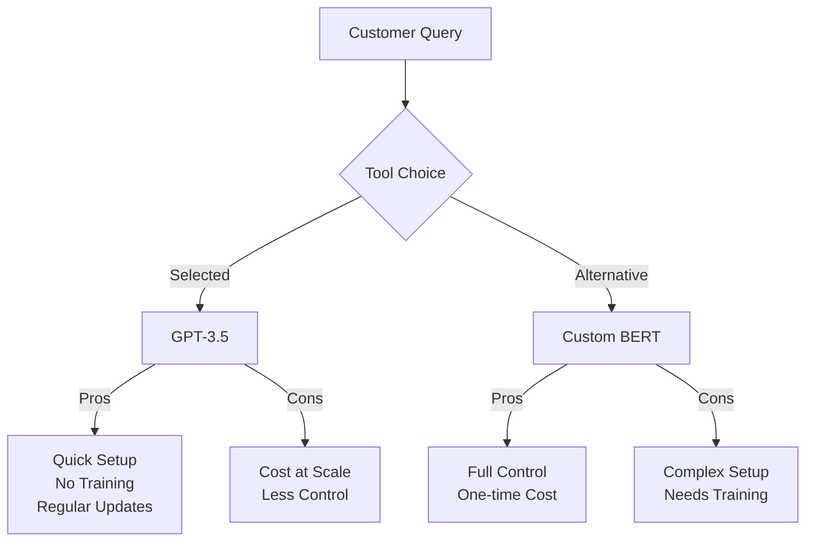
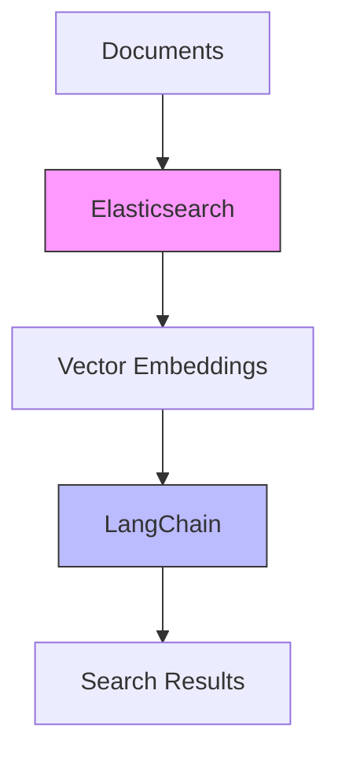

# AI Capabilities & Tools

## A Developer's Guide to Making Smart Choices

<div class="pt-12">
  <span @click="$slidev.nav.next" class="px-2 py-1 rounded cursor-pointer" hover="bg-white bg-opacity-10">
    Press Space for next page <carbon:arrow-right class="inline"/>
  </span>
</div>

---
layout: two-cols
---

# Overview

Today we'll explore:

<v-clicks>

- 3 Core AI Capabilities

  - Text Understanding
  - Information Retrieval
  - Recommendation Systems

- 3 Real-world Case Studies
  - Practical Applications
  - Tool Selection
  - Trade-offs

</v-clicks>

::right::

<div class="ml-4">
  
</div>

---
layout: section
---

# Part 1: Core AI Capabilities

What your applications could do

---

# Text Understanding

Natural Language Processing & Comprehension

<v-clicks>

- **What it is:**

  - Converting human language into structured, actionable data
  - Understanding context, intent, and sentiment
  - Generating human-like responses

- **Key Applications:**
  - Content Analysis
  - Chatbots & Virtual Assistants
  - Document Processing
  - Translation Services

</v-clicks>

---

# Information Retrieval

Finding the needle in the digital haystack

<v-clicks>

- **What it is:**

  - Searching through vast amounts of data
  - Ranking results by relevance
  - Understanding semantic relationships

- **Key Applications:**
  - Search Engines
  - Knowledge Bases
  - Document Classification
  - Question Answering Systems

</v-clicks>

---

# Recommendation Systems

Personalized suggestions at scale

<v-clicks>

- **What it is:**

  - Predicting user preferences
  - Content/Product matching
  - Behavioral pattern analysis

- **Key Applications:**
  - E-commerce Product Suggestions
  - Content Discovery
  - Social Media Feeds
  - Learning Platforms

</v-clicks>

---
layout: section
---

# Part 2: Case Studies

Real-world applications and tool selection

---
layout: two-cols
---

# Case Study 1: Customer Support Bot

**Challenge:** High volume of repetitive customer queries

<v-clicks>

- **Capability Used:** Text Understanding
- **Selected Tool:** OpenAI GPT-3.5
- **Why This Tool:**
  - High accuracy in understanding context
  - Cost-effective for medium scale
  - Easy API integration
  - Quick deployment

</v-clicks>

::right::

<v-clicks>

**Alternative Considered:**



</v-clicks>

---

# Case Study 2: Enterprise Search

**Challenge:** Searching across multiple internal knowledge bases

<div class="grid grid-cols-2 gap-4">
<div>
<v-clicks>

- **Capability Used:** Information Retrieval
- **Selected Tool:** Elasticsearch + LangChain
- **Why This Stack:**
  - Scalable document indexing
  - Semantic search capabilities
  - Custom ranking control
  - Hybrid search approach

</v-clicks>
</div>

<div>
<v-clicks>



</v-clicks>
</div>
</div>

---

# Case Study 3: Content Platform

**Challenge:** Personalized content recommendations for users

<v-clicks>

- **Capability Used:** Recommendation System
- **Selected Tool:** TensorFlow Recommenders
- **Why This Tool:**
  - Handles sparse data well
  - Scalable to millions of users
  - Custom feature engineering
  - Open-source with active community

```python {all|4-5|7-8|all}
# Example: Two-Tower Model
user_model = tf.keras.Sequential([
    tf.keras.layers.Dense(256, activation='relu'),
    # User features processing
    tf.keras.layers.Dropout(0.5),
])
# Content features processing
content_model = tf.keras.Sequential([...])
```

</v-clicks>

---
layout: two-cols
---

# Making the Right Choice

Key Factors to Consider:

<v-clicks>

- **Scale Requirements**

  - Data volume
  - User base size
  - Response time needs

- **Resource Constraints**
  - Budget
  - Development time
  - Team expertise

</v-clicks>

::right::

<v-clicks>

- **Business Requirements**

  - Customization needs
  - Data privacy
  - Regulatory compliance

- **Maintenance**
  - Ongoing costs
  - Update frequency
  - Support availability

</v-clicks>

---
layout: center
class: text-center
---

# Thank You!

Questions?

[Slides Repository](https://github.com/yourusername/ai-capabilities-talk)

<!--
Presenter notes:
- Total time: 20 minutes
- Part 1: 8-9 minutes
- Part 2: 8-9 minutes
- Q&A: 2-3 minutes
-->
